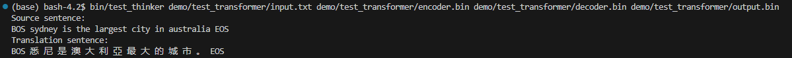

# Offline_translation

## 介绍

本项目基于transformer模型，使用聆思科技开源的AI生态工具链LNN(ListenAI Neural Network)，完成中英翻译任务的训练、量化、模型转换、仿真调试等一系列步骤，并实现在聆思CSK6-MIX芯片上进行推理。

## 环境配置

按照训练和推理两个步骤，创建两个虚拟环境linger-env和thinker-env。

训练环境配置：https://github.com/LISTENAI/linger/blob/main/doc/tutorial/install.md

推理环境配置：https://github.com/LISTENAI/thinker/blob/main/thinker/docs/tutorial/install.md

## 主要流程

### 1. 浮点训练

进入训练环境，使用linger的normalize相关接口对网络进行约束，将随机初始化的权重进行从0起步的浮点约束训练，将网络训练至收敛。

```bash
conda activate linger-env
```

```bash
python run.py
```

### 2. 量化训练和导出

加载步骤1中训练收敛的模型，使用linger的init相关接口进行量化训练微调直至收敛。

```bash
python run.py
```

使用linger的模型转换工具，将训练得到的pth模型转换为onnx模型，并支持动态维度的输入。

```bash
python tools/model_trans.py
```

### 3. 模型分析和打包

切换到推理环境，使用thinker离线工具tpacker对步骤2生成的onnx计算图打包，得到可以在芯片上读取运行的二进制模型文件。

```bash
conda activate thinker-env
```

```bash
tpacker -g encoder.onnx -d True -c en_len=32 -o encoder.bin
```

```bash
tpacker -g decoder.onnx -d True -c de_len=32,memory_len=32 -o decoder.bin
```

### 4. 推理执行

编译test_thinker，指定输入数据、模型文件和输出文件名称即可运行模拟代码，并打印翻译结果。

```bash
bash scripts/x86_linux.sh
```

```bash
bin/test_thinker demo/test_transformer/input.txt demo/test_transformer/encoder.bin demo/test_transformer/decoder.bin demo/test_transformer/output.bin
```



### 5. 编译和烧录

## 代码参考

https://github.com/hinesboy/transformer-simple

